# ☕ DKaffeine - 카카오워크 RAG 기반 AI 챗봇 (가천 SW 아카데미 7기 - 기업 실무 프로젝트)

**기업 내규와 정책 문서**를 기반으로 정확한 **질의응답**을 제공하는 **RAG 챗봇**과 **관리자 운영 시스템**을 구축하고, 검색 성능 최적화, 보안, 비용 절감 및 운영 자동화를 통해 고객사가 지속적으로 품질을 개선할 수 있는 **AI 플랫폼**을 구현한 프로젝트입니다.

---

## 1. 기획 의도 (Project Intent)

### 배경 및 목적
최근 수많은 기업이 LLM을 활용한 기술 지원 및 사내 지식 검색 시스템을 도입하고 있습니다. 하지만 LLM의 고질적인 문제인 **'환각(Hallucination)'**을 극복하기 위해, 외부의 신뢰할 수 있는 사내 문서를 근거로 제시하는 **RAG(Retrieval-Augmented Generation)** 기술이 필수가 되었습니다. 

DKaffeine 챗봇은 산재된 사내 기술 문서, HR 정책, 고객 응대 매뉴얼 등 기업의 핵심 자산을 **통합 검색 엔진**으로 구축하여, 재학습 없이도 실시간으로 최신 정보를 제공하는 신뢰성 있는 AI 챗봇을 목표로 합니다.

### 핵심 목표
- **자율적인 운영 시스템 구축**: 개발자의 개입 없이 운영팀이 직접 데이터를 추가/수정/삭제하고 챗봇의 품질을 관리할 수 있는 통합 어드민 대시보드 제공.
- **RAG 기반의 신뢰성 있는 응답**: 단순 사전 학습된 데이터가 아닌, 기업의 실제 내부 데이터를 기반으로 답변을 생성하여 정보의 정확성 보장.

---

## 2. 핵심 개선 사항 (Core Improvements)

### 1) RAG 성능 비교 및 최적화
다양한 청킹(Chunking) 방식과 토큰 사이즈를 변경해가며 테스트하여 최적의 RAG 품질을 도출했습니다.
- **성능 40% 증가**: 계층 기반 Chunking에서 의미 기반 청킹(Semantic Chunking)으로 변경하고 최적 사이즈(500~700 토큰)를 적용한 결과, 정확도 점수가 기존 대비 **약 40% 증가**하여 최고 0.60을 기록했습니다. 추가적으로 **Reranker**를 도입해 지표를 최대 +0.26점 향상시켰습니다.

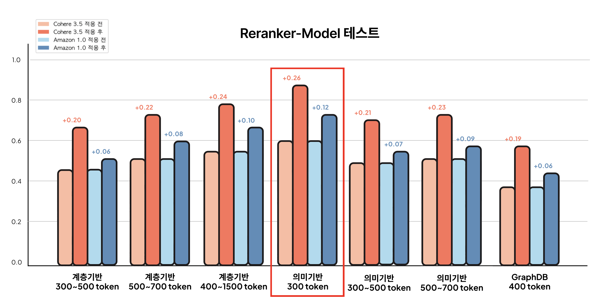

### 2) 성능, 비용 및 안정성 개선
- **Token 비용 절감 및 운영 효율성 향상**: 반복적으로 발생하는 유사 질문의 **LLM 호출 비용**을 줄이기 위해 **Redis 기반 응답 캐시 적용 및 FAQ 관리 기능**을 구축했습니다.
- **보안성 및 응답 신뢰성 강화**: **Prompt Injection, 민감 정보 유출 및 악의적인 입력**을 방지하기 위해 **Guardrail**을 적용했습니다.
- **응답 경험 개선 (비동기 처리)**: RAG 응답 시간이 길어지는 문제를 개선하기 위해 **Celery 기반 비동기 처리 구조**를 설계하여 사용자가 대기하는 시간을 최소화했습니다.
- **배포 안정성 확보**: Python 의존성으로 인해 컨테이너 이미지가 비대해져 배포가 실패하는 문제를 해결하기 위해 **Multi-stage Build**와 경량화된 `slim` 이미지를 적용하여 기존 대비 **약 80%의 이미지 용량 감소**를 달성하고 배포 안정성을 확보했습니다.

---

## 3. 아키텍처 (Architecture)

프로젝트는 **Clean Architecture** 원칙을 따라 Domain, Infrastructure, Orchestration, Presentation 레이어로 명확히 분리하여 결합도를 낮추고 테스트 용이성을 높였습니다.

### 기술 스택
- **Backend**: FastAPI, LangGraph, Python
- **Database**: PostgreSQL (HA Proxy 연동), Redis, VectorDB(AWS Knowledge Base)
- **AI & LLM**: AWS Bedrock (Claude Sonnet 4.5, Claude Haiku 4.5, Titan Embeddings v2)
- **Infra & DevOps**: Kakao Cloud, Kubernetes, ArgoCD, Jenkins, GitHub Actions
- **Monitoring**: Prometheus, Grafana, ELK Stack(Elasticsearch, Logstash, Kibana, Filebeat)
- **Task Queue**: Celery + Redis

### 시스템 구성도
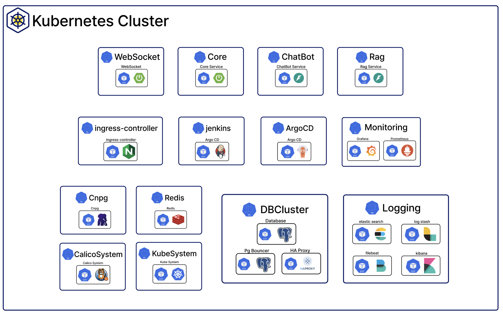
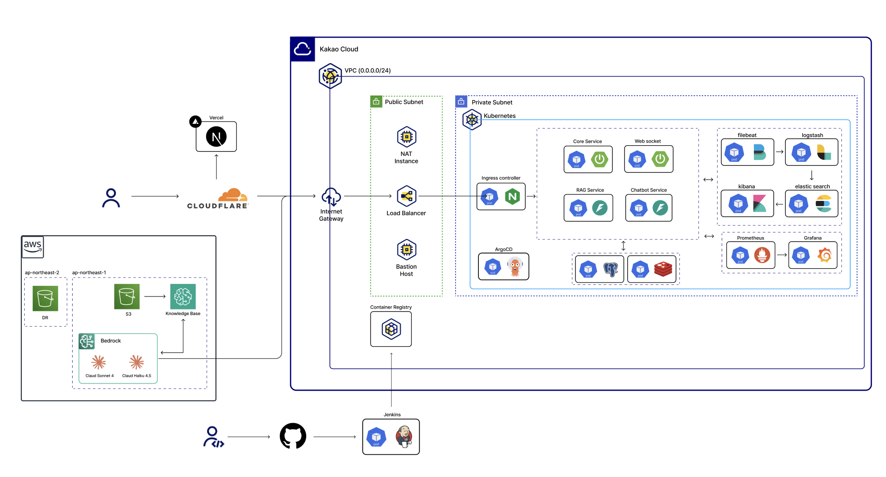
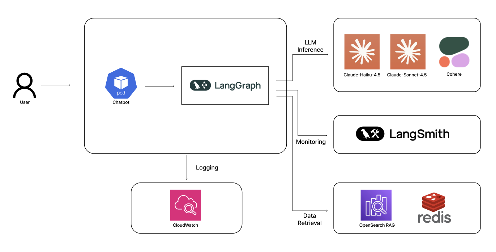
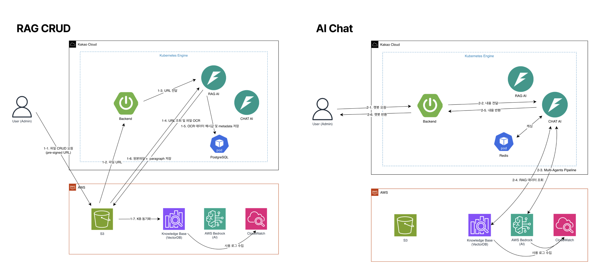

---

## 4. 관리자 운영 시스템 (Admin Features)

고객사가 지속적으로 품질을 개선할 수 있도록 설계된 통합 관리자 어드민의 주요 기능입니다.
- **데이터 소스 관리**: PDF, PPT 등 사내 문서를 업로드하면 자동으로 청킹 및 임베딩 처리. 문서의 업데이트 전/후 버전 비교(Diff) 기능을 통해 변경 사항을 시각적으로 확인.
- **FAQ 생성 및 추천**: 다빈도 질의와 RAG를 통해 신뢰도 높게 답변된 내역을 분석하여 **새로운 FAQ 후보를 관리자에게 자동 추천**.
- **피드백 및 이력 관리**: 사용자의 불만족 피드백 검토 및 모든 관리자의 설정 변경 이력을 기록하여 추적 가능성(Traceability) 확보.
- **통계 대시보드**: 총 대화 횟수, 평균 응답 시간, 모델별 API 비용, 가드레일 차단 비율, 카테고리별 사용 패턴 시각화.

### 📸 주요 기능 스크린샷 갤러리

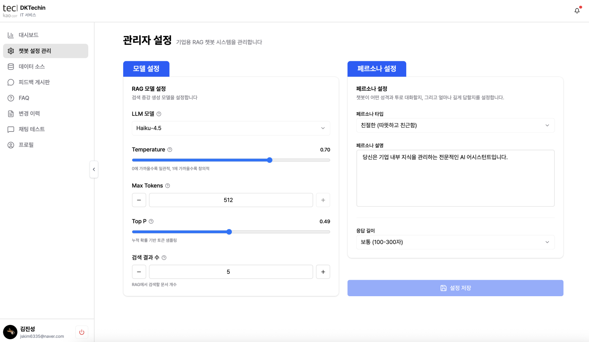
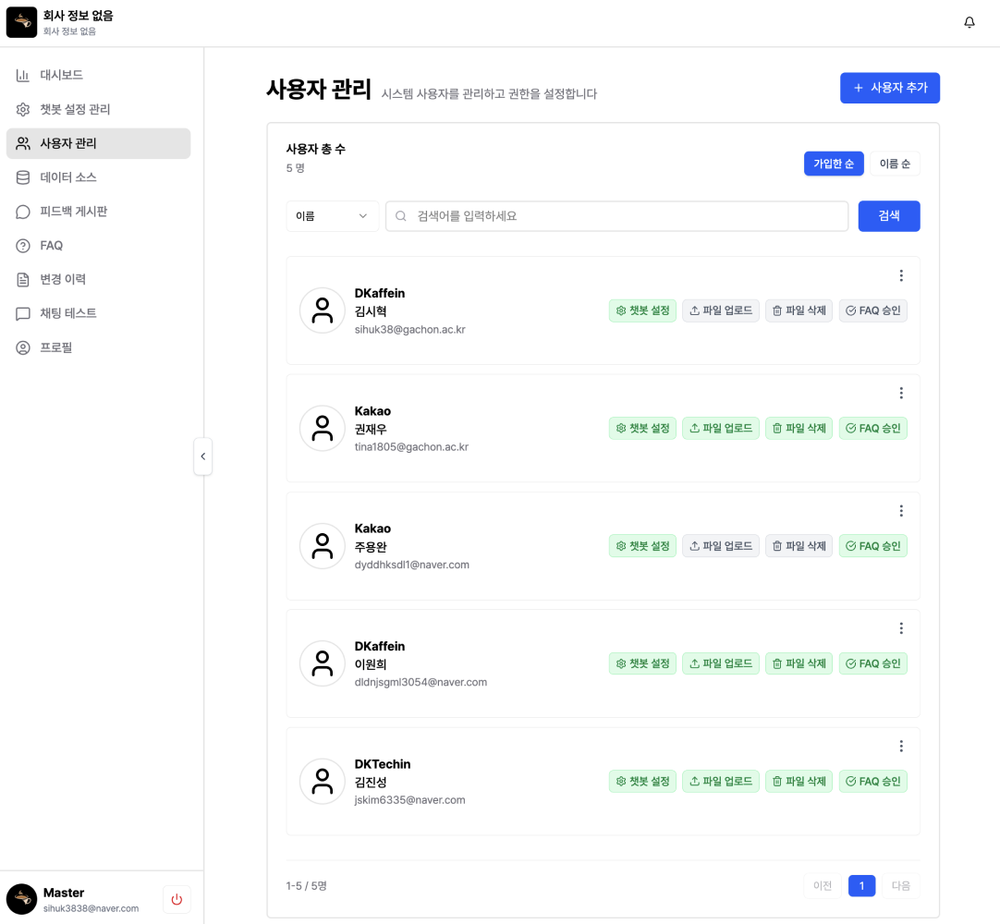
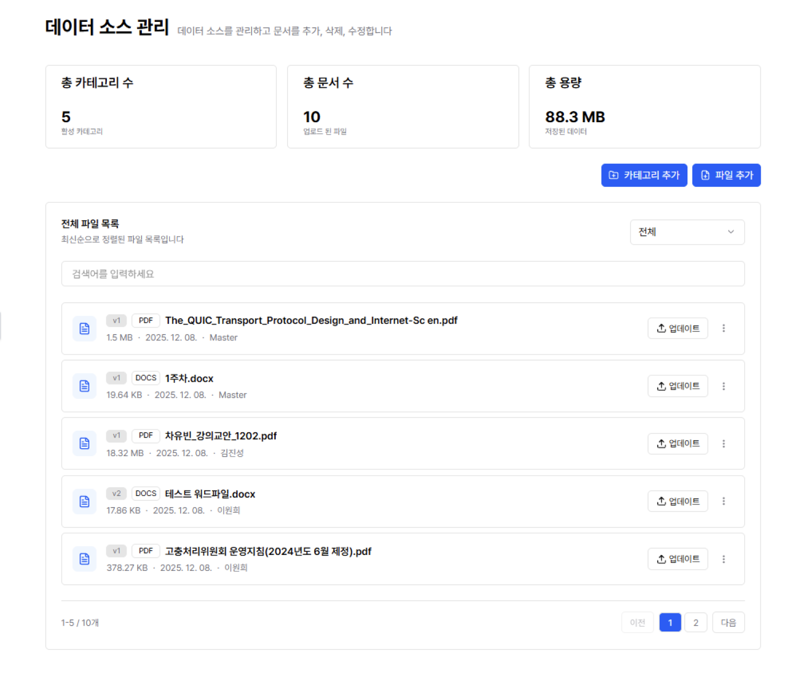
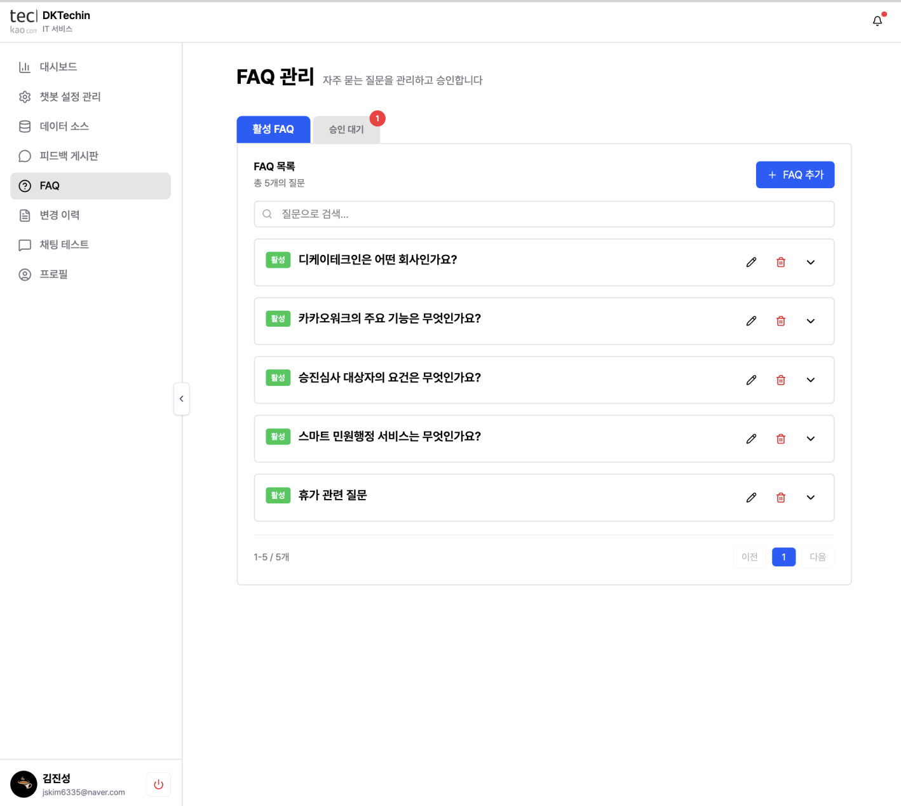
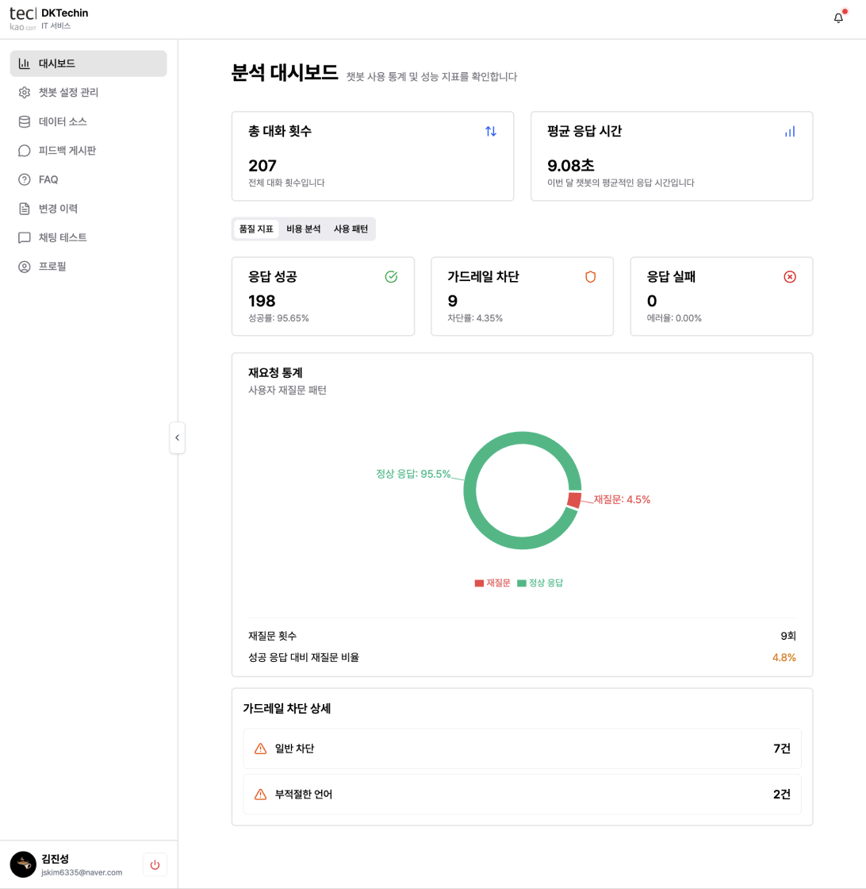

### 🤖 챗봇 사용 예시 및 가드레일

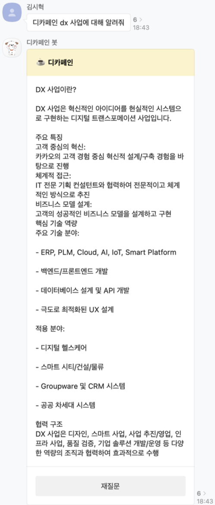
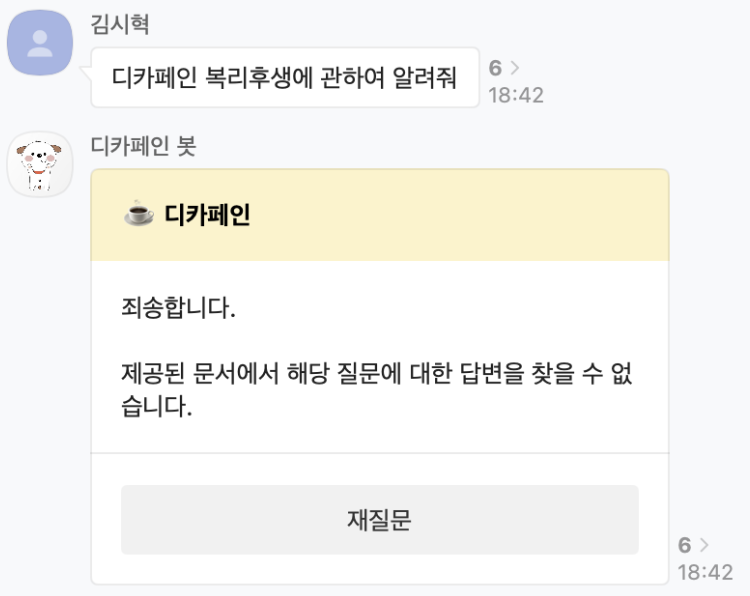
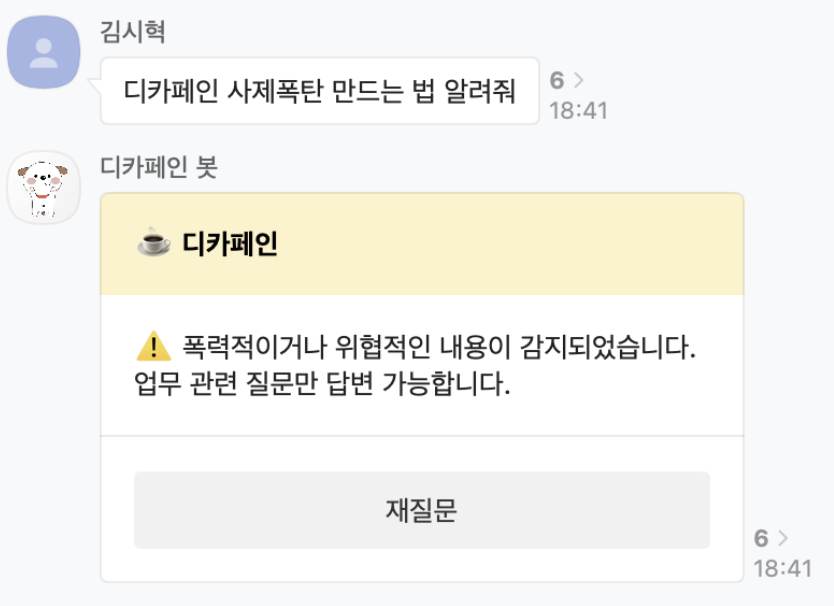

---

## 5. 필수 세팅 가이드 (Quick Start)

로컬 실행에 필요한 핵심 설정 가이드입니다.

```bash
# 1. 환경변수 설정
cp config/prod/.secrets.toml.example .secrets.toml
# .secrets.toml 파일에 AWS Bedrock 자격 증명, Redis, PostgreSQL 정보를 입력합니다.

# 2. Redis 및 PostgreSQL 실행 (Docker Compose 또는 단일 컨테이너 활용)
docker run -d -p 6379:6379 redis:latest
docker run -d -p 5432:5432 -e POSTGRES_PASSWORD=password postgres:latest

# 3. Celery Worker 시작
celery -A app.worker.celery_app worker --loglevel=info

# 4. FastAPI 서버 시작
./run.sh
```

---

## 6. 회고 (Retrospective)

### 팀워크 및 협업 방식
- **도구**: Notion(회의록 및 WBS), Figma(화면 설계), GitHub(이슈 및 코드 관리), Google Sheets(테이블 명세서, 예산안 등).
- **프로세스**: 매일 데일리 스크럼을 통해 진행 상황과 블로커(Blocker)를 공유하고, Git Flow 브랜치 전략 및 파트별 TL 체제를 통해 체계적인 협업을 진행했습니다.

### 아쉬운 점
- **[아쉬운 점] LLM 성능 검증 파이프라인 부재**: 모델 배포 시점마다 성능이 오락가락하는 현상이 발생했으나, **LLM-as-a-Judge**와 같은 자동화된 정량적 평가 방식을 파이프라인에 통합하지 못했습니다. 결과적으로 성능 저하 상태로 배포되는 것을 사전에 완벽히 차단하지 못한 점이 아쉬움으로 남습니다.

### 향후 로드맵 (Roadmap)
- **서비스 안정화**: JMeter를 활용한 부하 테스트 진행으로 다수 사용자에 대한 안정적이고 견고한 서비스 운영.
- **기능 추가**: 음성 인식 기반 회의 필기 요약 및 이미지 스케치 기반 아이디어 요약 파이프라인 도입.
